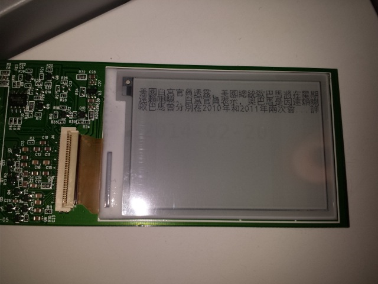

ebook
=====


### The Grand Vision for Sunny Book

Sunny book is a solar powered e-reader for learning things. It is designed for reading and acquiring knowledge especially in places where Internet connectivity or electricity are sparsely available. Everyone can use it, no matter who you are and where you are.

This is an open source, free e-reader project designed to work on Raspberry Pi with a Pervasive Display 2.7 inch screen.





### Development environment setup
You can acquire the actual hardware and wire up them up according to the following instructions:

https://github.com/repaper/gratis

http://learn.adafruit.com/repaper-eink-development-board-arm-linux-raspberry-pi-beagle-bone-black/overview

Alternatively, you can also jumpstart developing on linux (emulator mode) and output to an image file for the purpose of software development.

### Tutorial for actual hardware
1. Install PIL in your Python environemnt
2. Github the code from this repo
3. Run 
```
python TextFormatter.py
```

### Tutorial for emulator mode

1. Install PIL in your Python environemnt
2. Github the code from this repo
3. Run 
```
python TextFormatter2.py
```


### Upcoming features
- Parse uPub format
- Book sharing feature


### License

This project is licensed under Apache License 2.0


